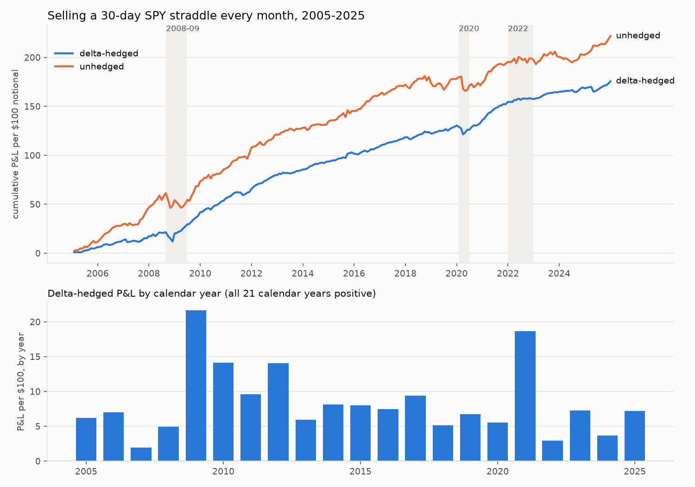
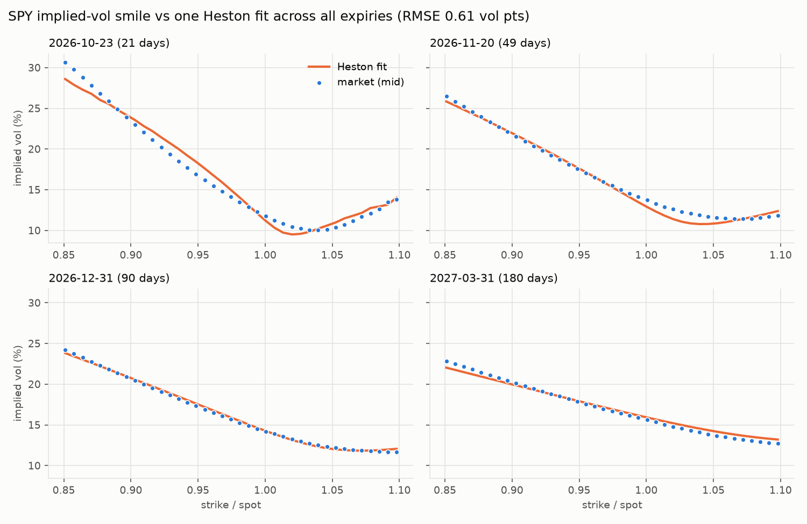
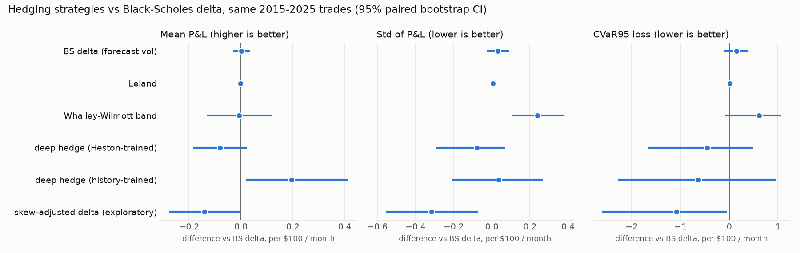
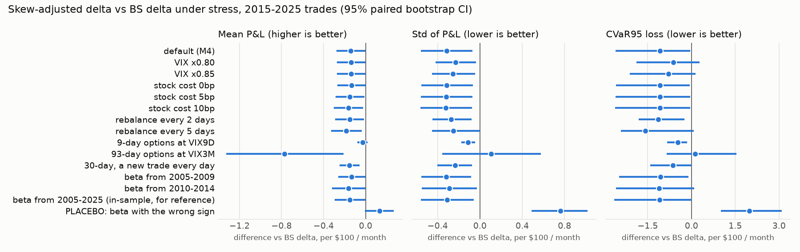

# hedgelab

Research project: **if you sell 30-day SPY options and hedge them daily, how much do you make or lose, and do better volatility forecasts or a learned hedge improve it after trading costs?**

**Status:** M5 of 6 done (baseline, Heston model, hedging comparison, robustness below). Full roadmap: [docs/PLAN.md](docs/PLAN.md).

**Findings so far:**
1. **The premium from selling at-the-money straddles depends on where they really trade.** Priced at VIX, a delta-hedged monthly straddle earned a Sharpe of 1.8. Priced at 0.85 × VIX (close to the 0.84 measured on a live chain), the premium is statistically indistinguishable from zero. The variance premium sits mostly in the downside tail, not at the money.
2. **A one-line skew-adjusted delta hedges better than Black-Scholes delta and better than neural-network hedgers.** BS delta + vega × (VIX-vs-return slope from training years) cut P&L std by ~25% and the worst month from −6.07 to −2.30 out of sample. It survives 11 of 13 robustness stresses, and a wrong-sign placebo does clear harm. It fails for 93-day options and is borderline with weekly rebalancing.
3. **Neural-network hedges didn't beat Black-Scholes delta reliably.** What they learned points to the same spot-vol effect that finding 2 captures directly.

## First result: the baseline trade

On the first trading day of every month from 2005 to 2025 (252 trades), sell a 30-day at-the-money SPY straddle priced at VIX-implied vol, delta-hedge it at every daily close paying 2 bp per stock trade, and settle at expiry.

| Strategy | Mean P&L per $100 notional per month (95% CI) | Annualized Sharpe (95% CI) | Worst month | Months profitable |
|---|---|---|---|---|
| **Delta-hedged** | **0.70 (0.52 – 0.89)** | **1.82 (1.24 – 2.63)** | −6.07 | 79% |
| Delta-hedged, no costs | 0.76 (0.59 – 0.96) | 1.99 (1.40 – 2.85) | −6.01 | 81% |
| Unhedged | 0.88 (0.56 – 1.18) | 1.23 (0.71 – 1.87) | −12.72 | 73% |

Intervals are stationary block-bootstrap intervals (blocks of consecutive months, so clustered crashes are resampled together).



**Where the money comes from.** Implied vol exceeded the volatility that followed in 83% of months. Each trade's P&L splits exactly into a gamma-weighted variance term, ½ Γ S² (σ²_implied Δt − r²) summed daily, plus a residual and costs. Over all trades, the **variance risk premium term is 109% of the total**, the residual is +2%, and stock trading costs take 10%.

**Crises:** the 2008–09 crisis was *profitable* on average (+0.80 per trade over 10 trades), because VIX was already extreme when the options were sold. Covid lost money (−0.60 per trade over 5 trades), because it hit while VIX was low. The single worst month was −6.07, about 3.5% of the 21-year cumulative P&L.

**Why these numbers are an upper bound for now:**
- VIX is a variance-swap level and runs above at-the-money implied vol because of the volatility skew, so pricing the straddle at VIX overstates the premium collected.
- There is no option bid-ask cost yet.

**M5 tested both** (see Robustness below). Costs don't kill the premium, but pricing at 0.85 × VIX does. The Heston work below measures the first caveat directly: on one recent day, VIX overstated 30-day at-the-money vol by 16%. Data: [results/baseline_summary.csv](results/baseline_summary.csv), [baseline_periods.csv](results/baseline_periods.csv), [baseline_trades.csv](results/baseline_trades.csv); reproduce with `python -m hedgelab.run baseline`.

## Heston stochastic volatility

Black-Scholes assumes one constant vol. Heston lets variance itself move randomly, mean-revert, and correlate with the stock, which produces the volatility skew seen in real option prices. M4 hedges in this world.

**Correctness.**
- The Fourier pricer matches an independent adaptive-quadrature integration to 10⁻⁴ for maturities from 9 days to 1 year, including short-dated options, where naive Fourier grids fail.
- It reduces to Black-Scholes when vol-of-vol → 0 (agreement to 10⁻⁸).
- It agrees with Andersen-QE Monte Carlo within 3 standard errors.
- Both calibrations recover known parameters from synthetic data.

**Calibration 1: 15 years of the VIX term structure** (VIX9D/VIX/VIX3M/VIX6M, 2011–2025, 3,771 days). The fit gives mean reversion κ = 4.2, long-run vol 24.1%, and from the return/variance history, correlation ρ = −0.69 and vol-of-vol ξ = 1.67. **A one-factor model can't fit the whole curve:** errors are 1.0 vol point at 30 days but 2.4 at 9 days and 2.7 at 6 months. One mean-reversion speed is too rigid, which is the usual motivation for two-factor models.

**Calibration 2: a live SPY option chain** (close of 2026-10-02, 499 out-of-the-money quotes across 13 expiries from 14 to 180 days). Each expiry's forward is backed out from put-call parity, not assumed from trailing dividends. That removed a ~1 vol-point jump where the quotes switch from puts to calls. One parameter set (v₀ = 10.7% vol, κ = 12.2, long-run 19.0%, ξ = 2.05, ρ = −0.60) fits every expiry to **0.61 vol points RMSE**. The fit is 0.2 vol points around 3–4 months and 1.6 at 14 days. Heston can't make the short-dated skew steep enough, the classic argument for adding jumps.



**What this says about the baseline.**
- On this date, 30-day at-the-money implied vol was **12.9% vs VIX 15.3% (ratio 0.84)**. The M2 trade prices options at VIX, so it overstates the premium collected; M5 will re-run it at 0.80–1.0 × VIX.
- The two calibrations disagree on mean reversion (12.2 from one day of options vs 4.2 from 15 years of VIX), and the chain fit violates the Feller condition. Both are common in practice: they're different measures (one day's risk-neutral surface vs a 15-year average), and Heston is too simple to be consistent across them.

Data: [results/heston_timeseries.csv](results/heston_timeseries.csv), [heston_chain_fit.csv](results/heston_chain_fit.csv), [heston_chain_by_expiry.csv](results/heston_chain_by_expiry.csv); reproduce with `python -m hedgelab.run heston`. The chain is one snapshot cached locally: free data has no option history, so re-downloading on a new day gives a new fit.

## Which hedge keeps the most? (out-of-sample, 2015–2025)

The same 132 monthly straddle trades, hedged seven ways at 2 bp per stock trade. Everything learned or tuned uses only 2005–2014 data:
- the 30-day vol forecast, refit walk-forward on outcomes already known;
- the band's risk aversion, chosen by CVaR95 on trades that settled before 2015;
- the Heston parameters, re-calibrated on 2008–2014;
- the deep hedges' training data.

Comparisons are **paired** (same trades), with stationary-bootstrap 95% intervals.

| Strategy | Mean P&L | Std | CVaR95 loss | Worst month | Sharpe |
|---|---|---|---|---|---|
| No hedge | 0.66 | 2.64 | 6.00 | −12.72 | 0.87 |
| **BS delta at implied vol** (reference) | 0.62 | 1.29 | 2.79 | −6.07 | 1.67 |
| BS delta at forecast vol | 0.62 | 1.32 | 2.94 | −6.74 | 1.63 |
| Leland delta | 0.62 | 1.29 | 2.80 | −6.14 | 1.66 |
| Whalley-Wilmott band | 0.61 | 1.53 | 3.40 | −5.46 | 1.39 |
| Deep hedge, trained on calibrated Heston paths | 0.54 | 1.21 | 2.34 | −6.92 | 1.55 |
| Deep hedge, trained on 2004–14 history | 0.82 | 1.33 | 2.15 | −7.72 | 2.13 |
| *Skew-adjusted delta (exploratory, see below)* | *0.48* | ***0.97*** | ***1.71*** | ***−2.30*** | *1.71* |

Per $100 notional per month. Deep hedges are 3-seed ensembles.



**What holds up.**
- **The neural networks didn't beat Black-Scholes delta in any statistically reliable way.** Their tail-risk reductions have intervals spanning zero. The history-trained network's higher mean (+0.20, p = 0.025) doesn't survive a correction for the 18 pre-declared comparisons (Bonferroni threshold 0.0028), and its three seeds disagree widely (CVaR95 1.98 to 3.35).
- **Forecast-vol and Leland deltas are indistinguishable from plain delta**, and the Whalley-Wilmott band **significantly increases risk** (std +0.24, p = 0.0004, the one comparison that survives correction). At 2 bp there's too little trading cost for a no-trade band to save.

**What the networks were learning.** Both deep hedges hold *fewer* shares than delta. They gain in months SPY falls and give a little back when it rises (results/hedges_direction.csv). That is the signature of spot-vol correlation: equity implied vol jumps in sell-offs, so a short straddle loses more in a crash than Black-Scholes assumes. The textbook fix is a minimum-variance delta (Hull & White, 2017): BS delta + vega × ∂σ/∂S. **A one-line version of it** (β = −1.23 vol per unit return, estimated on 2005–2014 only) cut the standard deviation by 0.32 (p = 0.008), CVaR95 by 1.08 (p = 0.04), and the worst month from −6.07 to −2.30. It paid 0.14 per month in mean P&L for that protection. Over the full 2005–2025 period its Sharpe is 1.98, against 1.82 for plain delta.

**Why it was labelled exploratory:** I added it *after* seeing the deep-hedge results, to explain them, so its p-values weren't pre-declared evidence. M5 then tested it against a pass/fail rule fixed in advance. It survived 11 of 13 stresses, and the wrong-sign placebo failed badly (see Robustness below).

## Robustness

Two questions, each answered with pre-declared criteria.

**1. Does the baseline premium survive pessimistic assumptions?** The test is whether the 95% interval of mean P&L stays above zero. Results are for the delta-hedged monthly straddle, 2005–2025:

| Setting | Mean per $100 / month (95% CI) | Sharpe | Survives |
|---|---|---|---|
| Default (VIX × 1.00, 2 bp) | 0.70 (0.52 – 0.89) | 1.82 | yes |
| Stock cost 10 bp | 0.43 (0.25 – 0.63) | 1.11 | yes |
| Option entry cost 3% of premium | 0.57 (0.39 – 0.75) | 1.49 | yes |
| VIX × 0.95 | 0.49 (0.32 – 0.67) | 1.31 | yes |
| VIX × 0.90 | 0.28 (0.12 – 0.44) | 0.77 | yes |
| **VIX × 0.85** | **0.07 (−0.09 – 0.23)** | 0.19 | **no** |
| VIX × 0.80 | −0.14 (−0.30 – 0.01) | −0.41 | no |
| Pessimistic: VIX × 0.85, 5 bp, 1% entry | −0.08 (−0.24 – 0.09) | −0.22 | no |
| 9-day options at VIX9D (2011+) | 0.16 (0.06 – 0.27) | 0.67 | yes |
| 93-day options at VIX3M (overlapping) | 1.82 (1.35 – 2.28) | — | yes |
| New 30-day trade every day (5,265 overlapping) | 0.72 (0.57 – 0.86) | — | yes |

13 of 17 settings survive ([full table](results/robustness_baseline.csv)). **All four failures are VIX ≤ 0.85 settings**, and M3 measured at-the-money vol at 0.84 × VIX on a live chain. VIX is a variance-swap level that loads on expensive out-of-the-money puts, so it overstates the at-the-money premium. The conclusion: delta-hedged ATM straddles priced where they actually trade capture little of the variance premium. The premium lives mostly in the skew (downside puts), which is consistent with the academic literature and a better finding than an inflated Sharpe.

**2. Is the skew-adjusted delta real?** The rule, fixed before running: it survives a stress if its paired std reduction against BS delta has a 95% interval entirely below zero, on 2015–2025 trades with β from training years only. A wrong-sign β (placebo) must do harm.



- **It survives 11 of 13 out-of-sample stresses:**
  - VIX scaled to 0.80 and 0.85;
  - stock costs of 0, 5 and 10 bp;
  - rebalancing every 2 days;
  - 9-day options;
  - a new trade every day (2,748 overlapping trades);
  - β estimated on 2005–09 only or 2010–14 only.
- **The placebo does clear harm:** std +0.76 (CI +0.49 to +1.02) and CVaR95 +1.98, both p < 0.001.
- **Where it fails:**
  - **93-day options** (std +0.11, not significant). β was estimated from 30-day VIX moves, and 3-month vol moves less, so it over-corrects; a β from VIX3M is the obvious fix.
  - **Rebalancing only every 5 days**, narrowly: the interval's upper end is +0.001.
- **The cost is consistent:** about 0.14 per $100 per month of mean P&L, the price of protection, in every setting.

**The caveat that remains:** the strategy was proposed after looking at the 2015–2025 trades, and the robustness checks vary the settings but reuse those trades. The clean confirmation is 2026-onward data, which this project can re-run on unchanged.

Data: [results/robustness_baseline.csv](results/robustness_baseline.csv), [robustness_skew.csv](results/robustness_skew.csv); reproduce with `python -m hedgelab.run robustness` (~1.5 min).

Data: [results/hedges_summary.csv](results/hedges_summary.csv), [hedges_paired.csv](results/hedges_paired.csv), [hedges_direction.csv](results/hedges_direction.csv), [hedges_seeds.csv](results/hedges_seeds.csv), [hedges_setup.csv](results/hedges_setup.csv); reproduce with `python -m hedgelab.run hedges` (~3 min).

## Data

21 years of daily data (2004-2025, 5,534 trading days) from Yahoo Finance: SPY prices and dividends, VIX, the VIX term structure (VIX9D from 2011, VIX3M from 2006, VIX6M from 2008), and the 3-month T-bill rate. Every load is validated, and the run fails loudly on gaps, impossible price bars, absurd moves, or out-of-range levels. Coverage: [results/data_coverage.csv](results/data_coverage.csv). Raw data is cached locally and not committed.

## Modules

| Module | What it does |
|---|---|
| `hedgelab.data` | download, cache, align across timezones, validate |
| `hedgelab.trades` | monthly short straddle, daily delta hedge, exact P&L decomposition (VRP term / residual / costs) |
| `hedgelab.stats` | stationary block bootstrap, Newey-West, paired comparisons |
| `hedgelab.heston` | Fourier pricer, QE Monte Carlo, calibration to the VIX term structure and to an option chain |
| `hedgelab.strategies` | hedging policies (forecast-vol, Leland, Whalley-Wilmott, skew-adjusted, deep) and deep-hedge training |
| `hedgelab.run` | regenerates everything in `results/` |
| `hedgelab.pricing` | Black-Scholes, Greeks, implied vol, binomial tree, Monte Carlo (European, Asian with control variate) |
| `hedgelab.volatility` | GARCH / HAR-RV / linear-log / MLP forecasts, walk-forward, QLIKE, Diebold-Mariano |
| `hedgelab.hedging` | CVaR-trained deep hedger vs BS delta and Leland delta under transaction costs |

## Develop

```bash
python3 -m venv .venv && .venv/bin/pip install -e ".[dev]"
.venv/bin/ruff check .
.venv/bin/pytest -q -m "not slow"                                 # fast suite (what CI runs)
.venv/bin/pytest -q                                               # everything, incl. model training
.venv/bin/pytest -q tests/test_pricing.py::test_put_call_parity   # one test
```

Example scripts (these download data or train models, so they take minutes) are in `examples/`.
