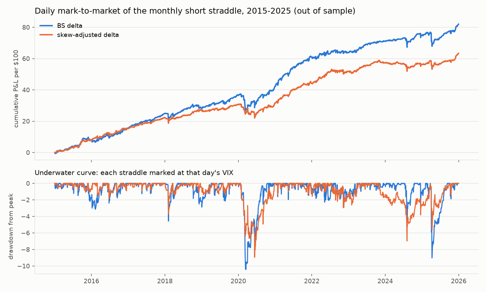

# hedgelab

**If you sell 30-day SPY options and delta-hedge them daily, what do you actually earn, where does it come from, and can smarter hedging keep more of it?**

A research project on 21 years of daily SPY data (2005–2025, 252 monthly trades). It includes an exact P&L decomposition, a strict train/test split, block-bootstrap confidence intervals, a Heston stochastic-vol model calibrated to a live option chain, and seven hedging strategies, two of them neural networks.

## Findings

1. **The "free" volatility premium is mostly an artefact of pricing at VIX.** At VIX-implied vol, a delta-hedged monthly straddle earns 0.70% of notional per month (95% CI 0.52–0.89), a Sharpe of 1.82, and 109% of it is the variance risk premium. Priced at 0.85 × VIX, close to the 0.84 ratio measured on a live SPY chain, the premium is statistically zero (0.07, CI −0.09 to 0.23). Costs don't kill it; pricing does. The premium lives in the downside skew, not at the money.
2. **A one-line skew-adjusted delta hedges better than Black-Scholes, out of sample.** Black-Scholes delta + vega × (spot-vol slope estimated on 2005–2014) cut P&L volatility ~25% and the worst month from −6.07 to −2.30 on 2015–2025 trades. It passed 11 of 13 pre-declared stress tests, and a wrong-sign placebo did significant harm.
3. **Neural-network hedges did not beat Black-Scholes delta reliably.** What they learned was a noisy version of finding 2: they under-hedged and gained in sell-offs.

**Read more:**
- [docs/report.md](docs/report.md): the full research note.
- [docs/PLAN.md](docs/PLAN.md): how the project was built, milestone by milestone.


## How it works

- **The trade.** On the first trading day of each month, sell a 30-day at-the-money SPY straddle priced at VIX/100, delta-hedge it at every close (2 bp per stock trade), and settle at expiry. Time is calendar days / 365, the convention VIX uses.
- **The accounting.** An independent cash account (premium, stock trades, interest, dividends, costs, payoff) gives each trade's P&L. It splits *exactly* into a gamma-weighted variance-premium term, ½ Γ S² (σ²_implied Δt − r²) summed daily, plus a residual and costs.
- **No lookahead.** Hedging policies only ever receive history sliced to the current close; the engine slices it, so they can't reach the future. Every engine has a scramble-the-future test, and each test was shown to catch a deliberately injected leak.
- **Train/test.** Every hedge comparison uses 2015–2025 trades. Everything learned, tuned or calibrated uses 2005–2014 data only.
- **Statistics.** Stationary block bootstrap (crashes cluster), paired comparisons on the same trades, comparisons declared before results, and a Bonferroni check.

## Results

### 1. The baseline trade (2005–2025)

| Strategy | Mean per $100 / month (95% CI) | Sharpe (95% CI) | Worst month | Months profitable |
|---|---|---|---|---|
| **Delta-hedged** | **0.70 (0.52–0.89)** | **1.82 (1.24–2.63)** | −6.07 | 79% |
| Delta-hedged, no costs | 0.76 (0.59–0.96) | 1.99 (1.40–2.85) | −6.01 | 81% |
| Unhedged | 0.88 (0.56–1.18) | 1.23 (0.71–1.87) | −12.72 | 73% |

Implied vol beat the volatility that followed in 83% of months. The 2008–09 crisis was *profitable* on average (VIX was already extreme when the options were sold), while Covid lost money (it hit when VIX was low). The risk is unpriced volatility, not volatility itself.


### 2. Is the premium real? (13 of 17 settings survive)

| Options priced at | Mean per $100 / month (95% CI) | Sharpe |
|---|---|---|
| VIX × 1.00 | 0.70 (0.52–0.89) | 1.82 |
| VIX × 0.90 | 0.28 (0.12–0.44) | 0.77 |
| **VIX × 0.85** | **0.07 (−0.09–0.23)** | **0.19** |
| VIX × 0.80 | −0.14 (−0.30–0.01) | −0.41 |

It survives 10 bp stock costs, a 3% option entry cost, 9- and 93-day maturities, and daily overlapping entries. **All four failures are VIX ≤ 0.85.** VIX is a variance-swap level that includes expensive out-of-the-money puts. On a live chain, at-the-money vol was 0.84 × VIX ([table](results/robustness_baseline.csv)).

### 3. Which hedge keeps the most? (2015–2025, out of sample)

| Strategy | Mean | Std | CVaR95 | Worst month | Sharpe |
|---|---|---|---|---|---|
| No hedge | 0.66 | 2.64 | 6.00 | −12.72 | 0.87 |
| **Black-Scholes delta** (reference) | 0.62 | 1.29 | 2.79 | −6.07 | 1.67 |
| Delta at a walk-forward vol forecast | 0.62 | 1.32 | 2.94 | −6.74 | 1.63 |
| Leland delta | 0.62 | 1.29 | 2.80 | −6.14 | 1.66 |
| Whalley-Wilmott no-trade band | 0.61 | 1.53 | 3.40 | −5.46 | 1.39 |
| Deep hedge (trained on calibrated Heston paths) | 0.54 | 1.21 | 2.34 | −6.92 | 1.55 |
| Deep hedge (trained on 2004–14 history) | 0.82 | 1.33 | 2.15 | −7.72 | 2.13 |
| **Skew-adjusted delta** | 0.48 | **0.97** | **1.71** | **−2.30** | 1.71 |

Per $100 notional per month; deep hedges are 3-seed ensembles.

- **Vol forecast and Leland:** indistinguishable from plain delta.
- **No-trade band:** significantly *raises* risk at 2 bp costs (the only pre-declared result that survives Bonferroni).
- **Neural networks:** no reliable improvement. The history-trained net's higher mean doesn't survive correction, and its seeds disagree widely.
- **Diagnosis:** both networks under-hedge, gaining in sell-offs. That's spot-vol correlation, which the minimum-variance delta (Hull & White, 2017) corrects for.
- **Skew-adjusted delta:** the one-line version of that correction cut std by 0.32 (p = 0.008) and CVaR95 by 1.08 (p = 0.04), at a cost of 0.14 per month.


### 4. Is the skew-adjusted delta real?

The skew-adjusted delta was proposed after seeing results, so it was held to a rule fixed in advance: the paired std reduction's 95% interval must lie entirely below zero.

- **Passes 11 of 13** out-of-sample stresses: VIX scaling, 0–10 bp costs, 2-day rebalancing, 9-day options, daily overlapping trades, and β from 2005–09 or 2010–14 alone.
- **Fails for 93-day options.** β came from 30-day VIX moves, and 3-month vol moves less.
- **Fails narrowly with 5-day rebalancing.**
- **Wrong-sign placebo:** std +0.76 (p < 0.001).
- **Still open:** the tests reuse the 2015–25 trades it was found on, so 2026+ data is the clean confirmation ([table](results/robustness_skew.csv)).

### 5. Drawdowns, marked daily

Marking each open straddle at that day's VIX shows what month-end P&L hides.
- **BS delta:** maximum drawdown −10.4 per $100 (17 March 2020), against a worst month of −6.07.
- **Skew-adjusted delta:** −8.9, with the worst day cut from −4.2 to −3.0.
- **Not better every time:** it drew down more in August 2024 ([table](results/drawdowns.csv)).



### 6. Heston model (supporting)

- **Pricer correctness:** the Fourier pricer matches adaptive quadrature to 10⁻⁴ from 9 days to 1 year, and Monte Carlo within 3 standard errors.
- **VIX term structure, 2011–25:** long-run vol 24%, spot-vol correlation ρ = −0.69. One factor can't fit the whole curve (errors up to 2.7 vol points).
- **Live SPY chain, 499 quotes:** forwards backed out from put-call parity; one parameter set fits all 13 expiries to **0.61 vol points**, worst at 14 days, where jumps are missing.


## Limitations

- **No historical option quotes.** Premiums are VIX-implied, and finding 1 shows that choice matters.
- **One underlying, one strike, close-to-close hedging,** with flat proportional costs.
- **The skew-adjusted delta reuses its discovery period,** and its β doesn't transfer to 93-day options.
- **Deep hedges use untuned hyperparameters.**

Details: [docs/report.md](docs/report.md) §6–7.

## Reproduce

```bash
python3 -m venv .venv && .venv/bin/pip install -e ".[dev]"
.venv/bin/python -m hedgelab.run all      # ~6 min; downloads and caches data on first run
.venv/bin/pytest -q                       # 70+ tests
```

Sub-commands: `baseline`, `heston`, `hedges`, `robustness`, `drawdowns`. Raw market data is cached in `data/` (not committed). The option chain is one cached snapshot, so re-downloading on another day gives a different Heston fit.

## Modules

| Module | What it does |
|---|---|
| `hedgelab.data` | download, cache, timezone alignment, validation; live option-chain snapshot |
| `hedgelab.trades` | the trade engine: straddle, daily hedge, exact P&L decomposition, daily mark-to-market |
| `hedgelab.strategies` | hedging policies (forecast-vol, Leland, Whalley-Wilmott, skew-adjusted, deep) and deep-hedge training |
| `hedgelab.heston` | Fourier pricer, QE Monte Carlo, VIX-term-structure and option-chain calibration |
| `hedgelab.volatility` | walk-forward 30-day vol forecast (plus the original next-day GARCH/HAR/MLP study) |
| `hedgelab.stats` | stationary block bootstrap, paired tests, CVaR, Newey-West |
| `hedgelab.pricing` | Black-Scholes, Greeks, implied vol, binomial, Monte Carlo |
| `hedgelab.run` | regenerates everything in `results/` |
| `hedgelab.hedging` | the original simulated-world deep-hedging study (not used by the results) |
